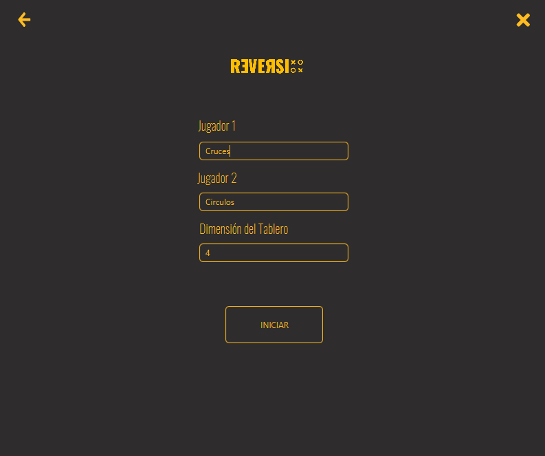
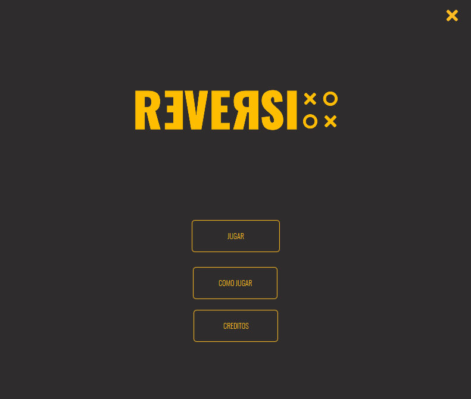
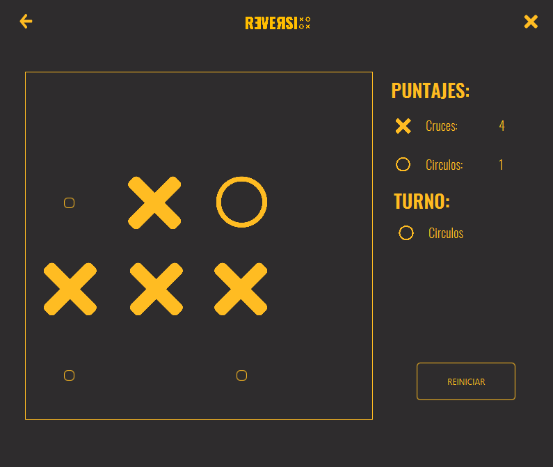
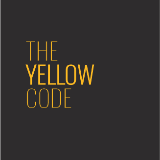

# Reversi
Juego Reversi para proyecto final de la materia Algoritmos y Programación I

## Cómo Jugar
[https://es.wikipedia.org/wiki/Reversi](https://es.wikipedia.org/wiki/Reversi)
[https://es.wikihow.com/jugar-a-Othello](https://es.wikihow.com/jugar-a-Othello)

## Capturas

## ¿Como lo hicimos?
El proyecto fue realizado en Java 8 utilizando como interfaz gráfica JavaFx, para desarrollar las interfaces utilizamos SceneBuilder, pruebas unitarias en JUnit y utilizando la metodología de desarrollo TDD.

## Consigna
[Link al repositorio de la consigna](https://github.com/mtugnarelli/tp-reversi)

## Miembro del grupo :eyes:

* Aaron Saban
* Fernando Gabriel Juares Coria
* Sabrina Micaela Cardoso

## Nombre del Grupo : The Yellow Code

